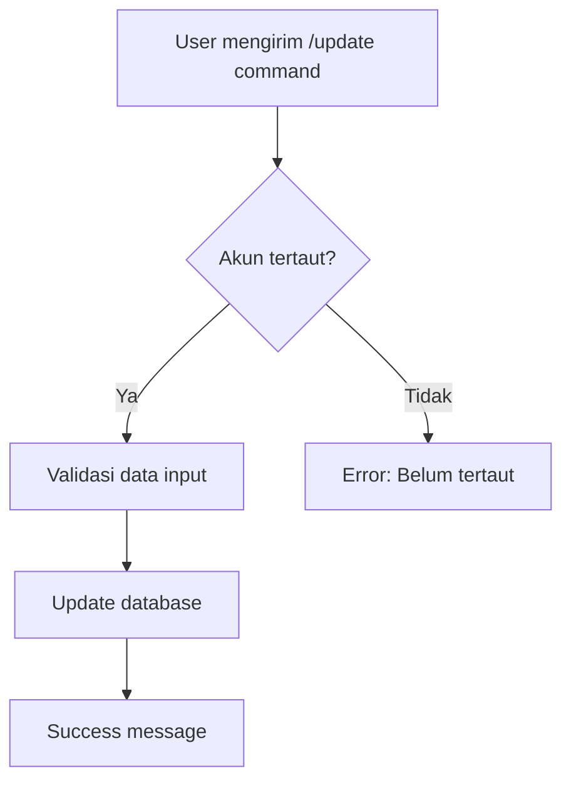

# Telegram Bot Integration

Bot Telegram pribadi untuk update data user melalui Telegram.

## Fitur

- 🔗 **Link Telegram Account**: Menautkan akun Telegram dengan user menggunakan UUID (NRP)
- ✏️ **Update Data**: Update nama, pangkat, telepon, dan username social media
- 📊 **View Data**: Melihat data user saat ini
- 🔒 **Secure**: Setiap Telegram ID hanya bisa tertaut dengan satu user
- 🤖 **Interactive**: Command-based interface yang mudah digunakan

## Setup Telegram Bot

### 1. Create Bot dengan BotFather

1. Buka Telegram dan cari `@BotFather`
2. Kirim command `/newbot`
3. Ikuti instruksi untuk membuat bot baru:
   - Berikan nama bot (contoh: "Hermes User Bot")
   - Berikan username bot (harus diakhiri dengan 'bot', contoh: "hermes_user_bot")
4. Simpan token yang diberikan oleh BotFather

### 2. Configure Environment

1. Copy `.env.example` menjadi `.env`
2. Tambahkan token bot ke file `.env`:

```env
TELEGRAM_BOT_TOKEN=1234567890:ABCdefGHIjklMNOpqrsTUVwxyz
```

### 3. Run Database Migration

Jalankan migration untuk menambahkan field `telegram_id` ke database:

```bash
psql -U postgres -d hermes_db -f migrations/004_add_telegram_id.sql
```

Atau jika menggunakan schema lengkap:

```bash
psql -U postgres -d hermes_db -f schema.sql
```

### 4. Start Application

```bash
npm start
```

Bot akan otomatis aktif jika `TELEGRAM_BOT_TOKEN` sudah dikonfigurasi.

## Cara Menggunakan Bot

### 1. Link Akun Telegram (Pertama Kali)

User harus menautkan akun Telegram mereka dengan UUID (NRP) mereka:

```
/link <UUID>
```

Contoh:
```
/link 550e8400-e29b-41d4-a716-446655440001
```

**Catatan**: UUID adalah NRP dari user yang sudah terdaftar di database.

### 2. Update Data User

Setelah akun tertaut, user dapat mengupdate data mereka:

#### Update Nama
```
/update_nama John Doe
```

#### Update Pangkat
```
/update_pangkat Kapten
```

#### Update Nomor Telepon
```
/update_telepon 081234567890
```

#### Update Instagram Username
```
/update_ig johndoe
```

#### Update Facebook Username
```
/update_fb john.doe
```

#### Update TikTok Username
```
/update_tt johndoe_official
```

#### Update X/Twitter Username
```
/update_x johndoe
```

#### Update YouTube Username
```
/update_yt johndoe
```

### 3. View Data

Lihat semua data user saat ini:

```
/mydata
```

### 4. Help

Untuk melihat daftar semua command:

```
/help
```

## Command List

| Command | Deskripsi | Contoh |
|---------|-----------|--------|
| `/start` | Memulai bot dan melihat instruksi | `/start` |
| `/help` | Menampilkan bantuan | `/help` |
| `/link <UUID>` | Menautkan akun Telegram dengan UUID | `/link 550e8400-e29b-41d4-a716-446655440001` |
| `/mydata` | Melihat semua data user | `/mydata` |
| `/update_nama <nama>` | Update nama lengkap | `/update_nama John Doe` |
| `/update_pangkat <pangkat>` | Update pangkat | `/update_pangkat Kapten` |
| `/update_telepon <telepon>` | Update nomor telepon | `/update_telepon 081234567890` |
| `/update_ig <username>` | Update Instagram username | `/update_ig johndoe` |
| `/update_fb <username>` | Update Facebook username | `/update_fb john.doe` |
| `/update_tt <username>` | Update TikTok username | `/update_tt johndoe_official` |
| `/update_x <username>` | Update X/Twitter username | `/update_x johndoe` |
| `/update_yt <username>` | Update YouTube username | `/update_yt johndoe` |

## Workflow

### User Onboarding Flow

```mermaid
graph TD
    A[User membuka bot] --> B[/start command]
    B --> C[Bot menampilkan welcome message]
    C --> D[User mengirim /link UUID]
    D --> E{UUID valid?}
    E -->|Ya| F[Cek Telegram ID]
    E -->|Tidak| G[Error: UUID tidak ditemukan]
    F --> H{Telegram sudah tertaut?}
    H -->|Belum| I[Link Telegram ID ke user]
    H -->|Sudah| J{UUID sama?}
    J -->|Ya| I
    J -->|Tidak| K[Error: Telegram sudah tertaut]
    I --> L[Success: Akun tertaut]
    L --> M[User bisa update data]
```

### Data Update Flow



## Security

- ✅ Setiap Telegram ID hanya bisa tertaut dengan satu UUID
- ✅ User hanya bisa update data mereka sendiri
- ✅ UUID harus valid dan ada di database
- ✅ Validasi dilakukan sebelum setiap update

## Database Schema

Field baru yang ditambahkan ke tabel `users`:

```sql
telegram_id VARCHAR(50) UNIQUE
```

- **Type**: VARCHAR(50)
- **Unique**: Ya (satu Telegram ID hanya untuk satu user)
- **Nullable**: Ya (user belum tentu link Telegram)
- **Index**: Ya (untuk performa query yang lebih cepat)

## Technical Details

### Dependencies

- `node-telegram-bot-api`: Library untuk integrasi Telegram Bot API

### Bot Architecture

```
src/services/telegramBot.js
├── TelegramBotService (class)
│   ├── initialize()      - Initialize bot dengan token
│   ├── setupHandlers()   - Setup command handlers
│   ├── handleUpdate()    - Handle update commands
│   └── stop()           - Stop bot gracefully
```

### Integration Points

1. **Main Application** (`src/index.js`):
   - Bot diinisialisasi saat aplikasi start
   - Bot di-stop saat aplikasi shutdown (graceful shutdown)

2. **User Model** (`src/models/user.js`):
   - `getByTelegramId()`: Ambil user by Telegram ID
   - `updateByUuid()`: Update user data by UUID (partial update)

## Troubleshooting

### Bot tidak start

**Problem**: Bot tidak aktif saat aplikasi dijalankan

**Solution**:
1. Pastikan `TELEGRAM_BOT_TOKEN` sudah diset di `.env`
2. Cek log aplikasi untuk error message
3. Pastikan token valid dari BotFather

### Command tidak respond

**Problem**: Bot tidak merespond command

**Solution**:
1. Pastikan bot sudah di-start dengan `/start` command
2. Cek format command sudah benar
3. Cek log aplikasi untuk error

### Link gagal

**Problem**: Command `/link` gagal

**Solution**:
1. Pastikan UUID valid dan ada di database
2. Pastikan Telegram ID belum tertaut dengan user lain
3. Cek field `telegram_id` di database

## Testing

### Manual Testing

1. Start aplikasi:
```bash
npm start
```

2. Buka bot di Telegram
3. Test semua command sesuai daftar di atas
4. Verify data berubah di database:

```sql
SELECT uuid, nama, pangkat, telepon, telegram_id, ig_uname, fb_uname 
FROM users 
WHERE telegram_id IS NOT NULL;
```

## Notes

- Bot menggunakan polling mode (bukan webhook)
- Bot akan otomatis reconnect jika koneksi terputus
- Error akan di-log ke console untuk debugging
- Bot bisa di-disable dengan tidak mengset `TELEGRAM_BOT_TOKEN`

## Future Enhancements

Potential improvements untuk versi berikutnya:

- [ ] Webhook mode untuk production
- [ ] Multi-language support
- [ ] Inline keyboard untuk command shortcuts
- [ ] Admin commands untuk manage users
- [ ] Notification system untuk perubahan data
- [ ] Bulk update capabilities
- [ ] User profile picture upload
- [ ] Export data to PDF/Excel
